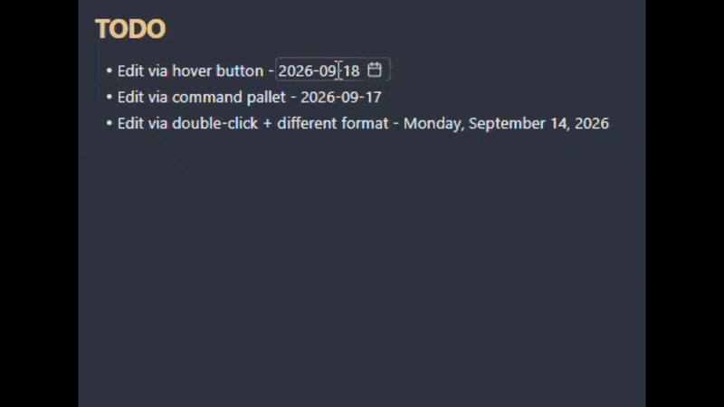

# Kalendae

Change an existing date in your note by picking it from a calendar, instead of retyping it.

> *Kalendae* — the first day of the Roman month, when a priest called out the dates for the month ahead.



## Using it

Kalendae recognises the dates in your notes. Three ways to open the calendar on one:

- Hover the date and click the calendar icon that appears beside it.
- Double-click the date.
- Put the cursor on the date and run **Kalendae: Pick a date** from the command palette.

Pick a day on the calendar, and Kalendae will rewrite the date in the original format.

## Date formats

Kalendae supports 10 built-in date formats, and you can create your own.
The default format is `YYYY-MM-DD`. Configure your formats under **Settings → Kalendae → Date formats**.


### Custom format
Write a custom format, using the [moment.js](https://momentjs.com/docs/#/displaying/format/) tokens that Obsidian relies on under the hood:

| Part | Tokens | |
|---|---|---|
| Year | `YY` `YYYY` | required |
| Month | `M` `MM` `MMM` `MMMM` | required |
| Day | `D` `DD` `Do` | required |
| Day of the week | `d` `dd` `ddd` `dddd` | optional |

Anything in the pattern that isn't an ASCII letter (a dash, a dot, a comma, parentheses, non-English letters) is matched as is and kept in the output. Square brackets `[` and `]` are the exception and can't be used.

## Where it looks

Define where you want your dates to be scanned and editable:

**Settings → Kalendae → Sections to scan**:

|Section|Description|Risk|Default|
|-|-|-|-|
|Body text|Regular paragraphs, lists, bold, italics, etc.|Safe|Always On|
|Headings|Section heading, e.g. `# 2026-09-10`|Can break references to this section|On|
|Frontmatter|Markdown file frontmatter|Obsidian has its own date picker for properties|Off|
|Inline code|Code inside text surrounded by \`|Safe|Off|
|Code blocks|Code sections surrounded by \`\`\`|Safe|Off|
|Wikilinks|Links to other notes|Can point to a note that doesn't exist|Off|

## Scope

Works in **Source mode** and **Live Preview**.
**Reading mode** is not supported, by design.

## Languages

English, Deutsch, Español, Eesti, Français, 日本語, 한국어, Lietuvių, Latviešu, Português, Русский,
Українська and 中文. Kalendae follows the language Obsidian is set to.

[Corrections and contributions](CONTRIBUTING.md) to other languages are welcome!

## Troubleshooting
If the date is not recognised, check these:
 - The format doesn't match any enabled ones in the settings
 - The section is not scanned, e.g. code block
 - A letter or digit touches it, e.g. `v2026-09-10`
 - The date is invalid, e.g. `2026-02-30`

## Development

```bash
npm install
npm run dev     # watch mode
npm run build   # typecheck + lint + production bundle
npm test
```

Symlink this folder into `<vault>/.obsidian/plugins/kalendae/` and install
[Hot Reload](https://github.com/pjeby/hot-reload) to get changes without restarting Obsidian.

See [CONTRIBUTING.md](CONTRIBUTING.md) for bug reports, feature requests, and translations.

## License

[GPL-3.0-only](LICENSE)
