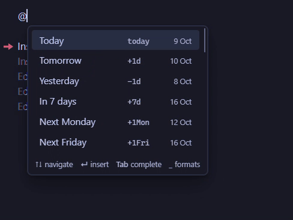
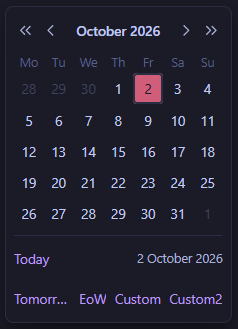
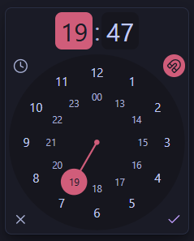
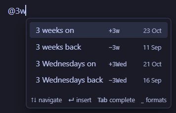
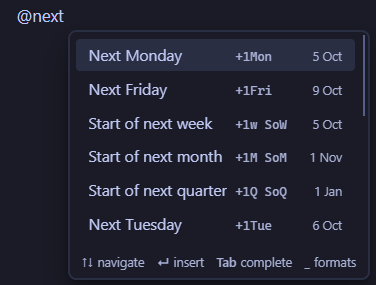
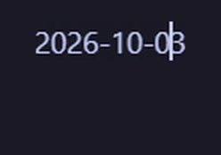

# Kalendae

Change a date or a time already in your note with a calendar, a clock, or Ctrl/Option + ↑/↓, instead of retyping it. Insert new dates by typing them in plain words.

> *Kalendae* — the first day of the Roman month, when a priest called out the dates for the month ahead.



---

## Features

- **Change a date**: click the calendar icon beside it or double-click it to open a calendar for selection.
- **Change a time**: click the clock icon beside it or double-click it to open a clock dial.
- **Calendar switcher**: configurable calendar view and custom shortcuts.
- **Type a date**: in plain words, like `tomorrow`, `next friday`, or `end of this quarter`. Press Enter to convert it to a format of your choice.
- **Quick adjustment**: hold Ctrl/Option and press ↑ or ↓ to step the part of a date or time under the cursor.
- **Your formats**: supports dates in 10 and times in 6 built-in formats, or custom ones. Keeps your format on updates.
- **13 interface languages**, matching your Obsidian language.

---

## Using it

Kalendae recognises the dates and times in your notes. Four ways to open the calendar or the clock on one:

- Hover the date or time and click the calendar or clock icon, respectively, that appears beside it.
- Double-click it.
- Click a Tasks plugin emoji in front of a date: ➕ 🛫 ⏳ 📅 ✅ ❌. Doesn't require the Tasks plugin.
- Put the cursor on it and run **Kalendae: Pick a date** or **Kalendae: Pick a time** from the command palette.

Pick a day or a time, and Kalendae rewrites it in its original format.

To add a new date or time, run **Kalendae: Pick a date** or **Kalendae: Pick a time** with the cursor anywhere else. You can also [type a date](#typing-a-date). New dates and times use the first format in their list.

---

## The calendar with quick dates



Pick a day from a month view, without typing.

Select a date, the static **Today** shortcut, or one of four configurable quick dates (18 built-in
plus custom).

**Settings → Kalendae → Calendar** lets you configure the first day of the week, week number
display, a preview of the new date, and quick dates.

---

## The clock



Pick a time from a clock dial, without typing.

Click the hour, then the minute, then the second if the time has one. The dial follows the time's format: 12 or 24 hours, with or without seconds, and AM/PM spelled the way your note spells it.

The clock icon in the corner writes the current time. The magnet snaps the minute hand to multiples of 5; turn it off in the picker to set exact minutes and seconds.

**Settings → Kalendae → Time picker** lets you configure minute snapping and when the time goes into your note: on ✓ click, on double-click, or on the last click.

---

## Typing a date

 

Type `@` at the start of a word, then the date. A list of suggestions opens and updates as you
type. Press Enter to write the highlighted date into your note.

| Say it | Examples |
|---|---|
| In words (English only) | `@next friday`, `@in three weeks`, `@3 months ago` |
| By name, in any language you turn on | `@Nov 3`, `@3 Nov 2027` |
| Shorthand | `@1d`, `@2w`, `@eom` (end of this month), `@2w EoW` (end of the week two weeks on) |

Type `_` before pressing Enter to write the date in another of your formats. Tab completes the
highlighted suggestion, and Esc closes the list without changing your text.

Change `@` and `_` under **Settings → Kalendae → Typing a date**. The **How to type a date** page walks through every way to say a date.

---

## Quick adjustment



Put the cursor on a date or a time, hold Ctrl/Option (configurable in settings), and press ↑ or ↓ to step the part under the cursor: the day, month, or year of a date, or the hour, minute, second, or AM/PM of a time.

A step carries into the next part: `14:59` goes to `15:00`, and `23:59` to `00:00`.

---

## Date and time formats

Kalendae supports 10 built-in date formats and 6 built-in time formats, and you can create your own.
The defaults are `YYYY-MM-DD` and `HH:mm`. Configure your formats under **Settings → Kalendae → Date formats** and **Time formats**.

When a date fits more than one format, like `03/09/2026` (3 September or 9 March), the first
matching format in your list wins. Drag the formats into the order you want.

Each time format also reads its time with seconds: `HH:mm` finds both `14:05` and `14:05:09`. When you change a time, it is written back with seconds if it had them and without if it didn't. AM/PM is read in any spelling (`pm`, `PM`, `p.m.`, `p`) and written back the way your note spelled it.

### Custom format
Write a custom format, using the [moment.js](https://momentjs.com/docs/#/displaying/format/) tokens that Obsidian relies on under the hood. A format is a date or a time, never both.

A date format:

| Part | Tokens | |
|---|---|---|
| Year | `YY` `YYYY` | required |
| Month | `M` `MM` `MMM` `MMMM` | required |
| Day | `D` `DD` `Do` | required |
| Day of the week | `d` `dd` `ddd` `dddd` | optional |

A time format:

| Part | Tokens | |
|---|---|---|
| Hour | `H` `HH` `h` `hh` | required |
| Minute | `m` `mm` | required |
| Second | `s` `ss` | optional |
| AM/PM | `a` `A` | required with `h` or `hh`, not allowed with `H` or `HH` |

Anything in the pattern that isn't an ASCII letter (a dash, a dot, a comma, parentheses, non-English letters) is matched as is and kept in the output. Square brackets `[` and `]` are the exception and can't be used.

---

## Where it looks

Choose the sections where Kalendae recognises the dates and times already in your note. The same sections decide where you can type a new date.

**Settings → Kalendae → Sections to scan**:

|Section|Description|Risk|Default|
|-|-|-|-|
|Body text|Regular paragraphs, lists, bold, italics, etc.|Safe|Always On|
|Headings|Section heading, e.g. `# 2026-09-10`|Can break references to this section|On|
|Frontmatter|Markdown file frontmatter|Obsidian has its own date picker for properties|Off|
|Inline code|Code inside text surrounded by \`|Safe|Off|
|Code blocks|Code sections surrounded by \`\`\`|Safe|Off|
|Wikilinks|Links to other notes|Can point to a note that doesn't exist|Off|

The **Kalendae: Pick a date** and **Kalendae: Pick a time** commands and the Ctrl/Option + ↑/↓ keys work in every section, regardless of these settings.

---

## Scope

Works in **Source mode** and **Live Preview**.
**Reading mode** is not supported, by design.

---

## Languages

English, Deutsch, Español, Eesti, Français, 日本語, 한국어, Lietuvių, Latviešu, Português, Русский,
Українська, and 中文. Kalendae follows the language Obsidian is set to.

[Corrections and contributions](CONTRIBUTING.md) to other languages are welcome!

---

## Troubleshooting
If a date or time is not recognised, check these:
 - The format doesn't match any enabled ones in the settings
 - The section is not scanned, e.g. code block
 - A letter or digit touches it, e.g. `v2026-09-10` or `14:30h`
 - The date or time is invalid, e.g. `2026-02-30` or `25:10`
 - The month, weekday, or AM/PM word is in a language that isn't turned on under **Settings → Kalendae → Languages**

If the list of dates doesn't open when you type `@`, check that it starts a word (`my@` doesn't
open it) and that the section is scanned.

If ↑ and ↓ don't change a date or time, an Obsidian hotkey may already use the same keys. Kalendae shows
a warning next to the setting when it does.

---

## Development

```bash
npm install
npm run dev     # watch mode
npm run build   # typecheck + lint + production bundle
npm test
```

Symlink this folder into `<vault>/.obsidian/plugins/kalendae/` and install
[Hot Reload](https://github.com/pjeby/hot-reload) to get changes without restarting Obsidian.

See [CONTRIBUTING.md](CONTRIBUTING.md) for bug reports, feature requests, and translations.

---

## License

[GPL-3.0-only](LICENSE)
